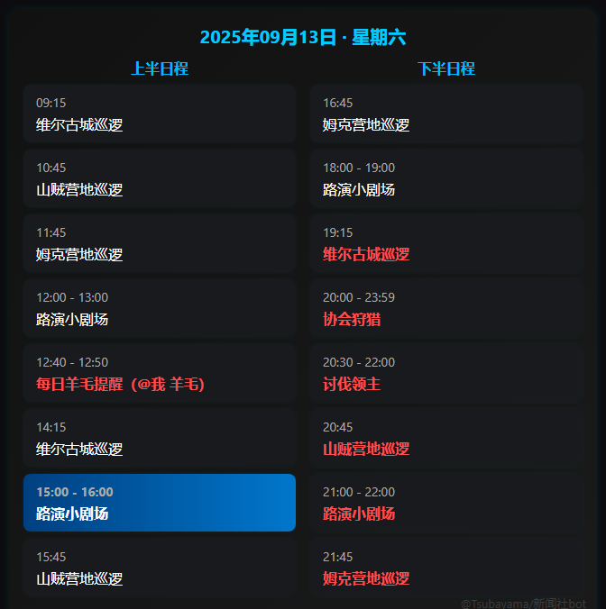

# nonebot-activity-reminder-pic

星痕共鸣活动提醒插件：

- **@bot 活动**：生成“今日活动安排”图片（Playwright 渲染）。
- **@bot 活动提醒 开|关**：在活动开始前 **10 分钟** 自动提醒（并附活动图，只有群主/管理员可用）。

> 基于 **NoneBot2** + **OneBot v11** 适配器 + **APScheduler** + **Playwright**。

## 预览



---

## 目录结构

```

nonebot-activity-reminder-pic/
├─ README.md
├─ activities.json        # 活动数据
├─ __init__.py            # 插件入口（指令、调度、配置）
└─ service.py             # 活动数据与出图服务

````

> 默认从 `nonebot-activity-reminder-pic/activities.json` 读取活动数据；提醒配置保存在同目录的 `reminder_config.json`（自动生成）。

---

## 安装

> 需要 Python 3.9+，建议使用虚拟环境。

```bash
pip install nonebot2[fastapi] nonebot-adapter-onebot apscheduler playwright

# 安装浏览器内核（首次）
python -m playwright install chromium

# （Linux 可能还需依赖）
python -m playwright install-deps
````

---

## 使用方法

* `@bot 活动`
  生成“今日活动”图片（按时间排序，分上下半日程；当前进行中的活动高亮显示，同一活动的最后一场以醒目样式标注）。

* `@bot 活动提醒 开`
  为“今天”的所有活动创建 **开始前 10 分钟** 的提醒任务；并创建**每日 00:01** 的重置任务，用于刷新当天的提醒计划。

* `@bot 活动提醒 关`
  关闭并清理本群全部提醒任务。

> **权限**：`活动提醒` 开/关 仅限 **群主/管理员**。

---

## 活动数据（`activities.json`）

示例：

```json
{
  "星光花火夜": {
    "days": ["Friday", "Sunday"],
    "start_times": ["20:20", "20:44", "21:08", "21:32", "21:56"],
    "duration_minutes": 10
  },
  "环城载具赛": {
    "days": ["Tuesday", "Thursday", "Saturday", "Sunday"],
    "start_times": ["10:00", "13:00", "16:00", "19:00", "22:00"],
    "duration_minutes": 60
  },
  "维尔古城巡逻": {
    "days": ["Everyday"],
    "start_times": ["09:15", "14:15", "19:15"],
    "duration_minutes": null
  }
}
```

* `days`：支持 `Everyday` 或英文星期（`Monday`…`Sunday`）。
* `start_times`：`"HH:MM"` 列表。
* `duration_minutes`：整数或 `null`（无固定时长）。

---

## 配置

* **提醒配置**：`nonebot-activity-reminder-pic/reminder_config.json`
  插件自动创建与维护，仅包含：

  ```json
  {
    "123456789": { "event_reminder": { "enabled": true } }
  }
  ```

  其中 `123456789` 为群号（字符串）。

* **行为说明**

  * 开启提醒后立即为当天活动创建“提前 10 分钟”的提醒任务；多活动同一开始时间会合并为一次消息。
  * 每天 **00:01** 自动重置：清理前一日任务并基于当日活动新建提醒任务。
  * 当日无活动时，`@bot 活动` 会返回“今日无活动安排”的占位图。

---

## 常见问题

1. **出图失败怎么办？**
   请确认已执行 `python -m playwright install chromium`，Linux 服务器可补充 `python -m playwright install-deps` 并安装必要系统库。

2. **时区问题**
   插件基于服务器本地时间计算提醒与渲染时间轴，请确保服务器时区与目标用户一致，或调整系统时区。

